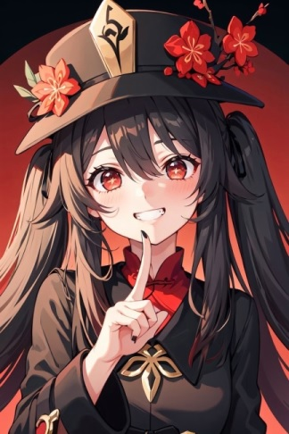
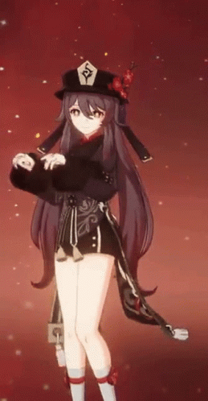

# Hu Tao

**Hu Tao** (Chinese: 胡桃 *Hú Táo*) is a playable **Pyro** character in [Genshin Impact](https://genshin.hoyoverse.com/en/).

Hu Tao's antics and eccentricity belies her role as the 77th Director of the Wangsheng Funeral Parlor and her talent as a poet. Nevertheless, she treats the parlor's operations with utmost importance, and holds funeral ceremonies with the highest dignity and solemnity.

---
## Main Build

|  | Hu tao |
| ----------- | ----------- |
| **Rating** | `SSS` |
| **Rarity** | ★★★★★ |
| **Element** | Pyro |
| **Voice Actors** | *Takahashi Rie* |
| **Weapon** | Polearm (**Staff of Homa**) |
| **Artifacts** | Crimson Witch of Flames x4 |
| **Main Stat** | CRIT Rate, CRIT DMG, HP%, Pyro DMG Bonus |

Based from the newest Hutao's Build Wiki. [^1]

---
## Hu Tao's Strengths and Weaknesses
### Strengths
- HP conversion to ATK contributes a huge amount of boost to her already good scaling and Vaporize potential.
- Monstrous DPS against boss-type enemies or in single target situations.
- Elemental Burst enables her to be self-sufficient especially with her high-risk, high-reward playstyle.
- Provides CRIT Rate for other party members.

### Weaknesses
- Often struggles against wild groups of enemies as she lacks AoE attacks outside of Elemental Burst.
- Fast application of the Pyro element reduces her best team comp choices, often necessitating either Xingqiu or Yelan.
- Unless you have her C1, limited stamina can dampen her performance and smoothness in playstyle.

---
## Hu Tao Talents (Skills)

* Normal Attack: Secret Spear of Wangsheng
  * Performs up to 6 consecutive spear strikes.
  * Charge Attack
  * Plunge Attack

* Guide to Afterlife
  * Only an unwavering flame can cleanse the impurities of this world Hu Tao consumes a set portion of her HP to knock the surrounding enemies back and enter the **Paramita Papilio state**.
  * Paramita Papilio State:
    1. Increases Hu Tao’s ATK based on her Max HP at the time of entering this state. ATK Bonus gained this way cannot exceed 400% of Hu Tao’s Base ATK.
    2. Converts attack DMG to Pyro DMG, which cannot be overridden by any other elemental infusion. Increases Hu Tao’s resistance to interruption. Paramita Papilio ends when its duration is over, or when Hu Tao has left the battlefield or fallen.
  * Blood Blossom Effect:
    * Enemies affected by Blood Blossom will take **Pyro DMG every 4s**. This DMG is considered Elemental Skill DMG. Each enemy can be affected by only one **Blood Blossom effect** at a time, and its duration may only be refreshed by Hu Tao herself.

* Spirit Soother
  * Commands a blazing spirit to attack, dealing Pyro DMG in a large AoE. Upon striking the enemy, regenerates a percentage of Hu Tao's Max HP. This effect can be triggered up to 5 times, based on the number of enemies hit. If Hu Tao's HP is below or equal to 50% when the enemy is hit, both the DMG and HP Regeneration are increased.

* Flutter By
  * When a Paramita Papilio state activated by Guide to Afterlife ends, all allies in the party (excluding Hu Tao herself) will have their CRIT Rate increased by 12% for 8s.

* Sanguine Rouge
  * When Hu Tao's HP is equal to or less than 50%, her Pyro Damage Bonus is increased by 33%

* The More the Merrier
  * When Hu Tao cooks a dish perfectly, she has an 18% chance to receive an additional ''Suspicious'' dish of the same type.

## Hu Tao's Talent Priority
1. Normal Attack or Elemental Skill

2. Elemental Burst
>Hu Tao's Normal Attack Talent and Elemental Skill should be leveled up equally, as these talents are Hu Tao's bread and butter. Don't forget to upgrade your Elemental Burst as well if you need more DMG and self healing.

---
## Hu Tao Best Team Comp

- All best Hu Tao teams need Xingqiu in their party as Xingqiu's Rainswords apply Hydro faster than Hu Tao's application, allowing her to consistently Vaporize the enemy.

- Having Yelan not only provides even more consistent off-field Hydro application, but will also provide a DMG boost to Hu Tao's already insane single target DMG as well as HP resonance

---
## Hu Tao Best Constellation
> C1 is Hu Tao's best constellation for players who want to maximize her damage. The only requirement for it to show it's true value is that players will need to cancel her Charged Attack animation with dashes.

1. Charge attacks cost 0 stamina while Hu Tao's Elemental Skill is active.
2. Increases Hu Tao's overall DPS.

---
## How to Use Hu Tao

### Elemental Skill Strengthens DMG

>Hu Tao's Elemental Skill allows her to sacrifice a certain amount of HP to infuse her weapon with the Pyro element. In addition to converting all damage to Pyro DMG, Hu Tao also receives an ATK boost.

>Use with caution, as overuse of Hu Tao's Elemental Skill might leave you with too little HP!

### Hu Tao's Elemental Burst

>Hu Tao's Elemental Burst allows her to swing around a fire spirit, dealing huge Pyro DMG in a wide area and healing herself. If Hu Tao has less than 50% HP, the DMG and healing are increased!

>**Use this to manage Hu Tao's HP loss!**. Since Hu Tao's Elemental Skill sacrifices your health, you will need to keep an eye on Hu Tao's health! Her Elemental Burst balances it out by dealing damage and healing Hu Tao at the same time

---
## Personal Opinion
Why I think Hu tao is the best
- `Super Strong DPS`
- `Crazy Personality`
- Einstein E = mc^2^ Ultimate Nuclear
- `Awesome Idle Animation`

[^1]: Source :[Hutao Fandom Wiki](https://genshin-impact.fandom.com/wiki/Hu_Tao)

E = mc^2^